# Fractal Fire Mamba - Complete System Architecture Flowchart

Visual guide to the 6-phase fire detection pipeline with file mappings and data flows.

---

## High-Level System Flow

```mermaid
graph TB
    START[🌲 Forest Sensors] --> P0[Phase-0: Sensor Fusion Mamba]
    P0 --> P1[Phase-1: Watchdog]
    P1 --> P2[Phase-2: Fractal Gate]
    P2 --> P3[Phase-3: Chaos Kernel]
    
    P2 -.should_activate_vision.-> P4[Phase-4: Vision Mamba]
    P3 -.-> P4
    
    P0 --> P5[Phase-5: Logic Gate]
    P1 --> P5
    P2 --> P5
    P3 --> P5
    P4 --> P5
    
    P5 --> P6[Phase-6: Communication]
    P6 --> SAT[📡 Satellite Alert]
    P6 --> LORA[📻 LoRa Mesh]
    P6 --> DASH[📊 Dashboard]
```



---

## Detailed Phase-by-Phase Flowchart

### PHASE-0: Sensor Fusion Mamba

**File**: `phases/phase0_fusion/fusion_engine.py`


**Output**:
```python
{
    'risk_score': 0.75,           # Combined risk (0-1)
    'state_vector': [64 values],  # Mamba hidden state
    'timestamp': datetime,
    'sensor_readings': {...}      # Raw sensor data
}
```

---

### PHASE-1: Watchdog Layer

**File**: `phases/phase1_watchdog/watchdog.py`

```mermaid
graph TD
    IN1[Risk Score from Phase-0] --> WD[Watchdog Layer]
    
    subgraph "4 Critical Checks"
        WD --> C1[CHECK-1: Range<br/>-40°C to 120°C valid?]
        WD --> C2[CHECK-2: Frozen<br/>Stuck for 5+ hours?]
        WD --> C3[CHECK-3: Null<br/>Missing data?]
        WD --> C4[CHECK-4: Trauma<br/>Post-anomaly paranoia]
        
        C1 --> V1{Valid?}
        C2 --> V2{Frozen?}
        C3 --> V3{Missing?}
        C4 --> V4{Trauma?}
        
        V1 -->|Pass| VALID[Validated Reading]
        V1 -->|Fail| REJECT[Reject Reading]
        
        V2 -->|No| VALID
        V2 -->|Yes| ALERT[P3 Maintenance Alert]
        
        V3 -->|No| VALID
        V3 -->|Yes| IMPUTE[Virtual Sensor<br/>Reliability: 0.8]
        
        V4 --> ADAPT[Adaptive Thresholds<br/>threshold × 1.1 - trauma]
    end
    
    VALID --> OUT1[Validated Risk Score<br/>+ Reliability Score]
    IMPUTE --> OUT1
    ADAPT --> OUT1
```



**Output**:
```python
{
    'validated_risk': 0.72,       # Validated risk
    'reliability': 0.95,          # Trust level (0.8 if imputed)
    'sensor_health': {...},       # Per-sensor health
    'trauma_level': 0.3,          # Paranoia factor
    'failed_sensors': []          # List of failed sensors
}
```

---

### PHASE-2: Fractal Gate (Hurst Exponent)

**File**: `phases/phase2_fractal/fractal_gate.py`


**Output**:
```python
{
    'hurst_exponent': 1.15,       # H > 1.0 = fire structure
    'has_structure': True,        # Passes fractal gate?
    'confidence': 0.85,           # Detection confidence
    'should_activate_vision': True, # Camera wake trigger
    'samples_analyzed': 100,
    'trauma_adjusted_threshold': 0.99
}
```

---

### PHASE-3: Chaos Kernel (Lyapunov Exponent)

**File**: `phases/phase3_chaos/chaos_kernel.py`

```mermaid
graph TD
    IN3[Risk Score Timeline] --> EMBED[Phase Space Embedding<br/>3D reconstruction]
    
    EMBED --> LYAP[Compute Lyapunov Exponent<br/>Divergence rate]
    
    LYAP --> L_VALUE{λ value?}
    
    L_VALUE -->|λ < 0| STABLE[Stable/Decaying<br/>Safe]
    L_VALUE -->|λ ≈ 0| NEUTRAL[Neutral Dynamics<br/>Monitoring]
    L_VALUE -->|λ > 0| CHAOS[Chaotic Growth<br/>FIRE SPREADING!]
    
    CHAOS --> REGIME[Regime Detection<br/>Pre-ignition vs Active Fire]
    
    REGIME --> OUT3[Chaos Analysis<br/>+ Growth Indicator]
```



**Output**:
```python
{
    'lyapunov_exponent': 0.12,    # λ > 0 = chaotic (fire)
    'is_chaotic': True,           # Exponential divergence?
    'regime': 'active_fire',      # Pre-ignition / active / decay
    'confidence': 0.78,
    'embedding_dimension': 3
}
```

---

### PHASE-4: Vision Mamba (RGB + Thermal) 🆕

**Files**: 
- `phases/phase4_vision/vision_mamba.py` (RGB smoke detection)
- `phases/phase4_vision/multi_spectral_vision.py` (RGB + Thermal wrapper)
- `processors/thermal_processor.py` (Thermal fire detection)


**Output**:
```python
{
    'vision_mode': 'night',       # 'day' / 'night' / 'dual' / 'blind'
    'camera_health': {
        'is_healthy': True,
        'health_score': 0.95
    },
    'smoke_analysis': {           # Or fire_analysis for thermal
        'smoke_confidence': 0.82, # Or hot_spot_presence
        'edge_sharpness': 0.35,   # Or thermal_gradient
        'histogram_variance': 0.78, # Or spread_pattern
        'requires_confirmation': False
    },
    'vision_weight': 0.28,        # Weight in final fusion (0-0.4)
    'confidence': 0.82
}
```

**Performance**:
- **Day mode**: 15-30s smoke detection
- **Night mode**: 15-30s fire detection (vs 45-90s before)
- **Power**: 23mA thermal vs 250mA RGB

---

### PHASE-5: Logic Gate (Final Decision)

**File**: `phases/phase5_logic/logic_gate.py`

```mermaid
graph TD
    subgraph "Input Aggregation"
        P0_IN[Phase-0: Risk Score]
        P1_IN[Phase-1: Validated Risk]
        P2_IN[Phase-2: Fractal Analysis]
        P3_IN[Phase-3: Chaos Analysis]
        P4_IN[Phase-4: Vision Confidence]
    end
    
    P0_IN --> FUSE_LOGIC[Multi-Phase Fusion]
    P1_IN --> FUSE_LOGIC
    P2_IN --> FUSE_LOGIC
    P3_IN --> FUSE_LOGIC
    P4_IN --> FUSE_LOGIC
    
    FUSE_LOGIC --> RISK{Final Risk<br/>Score?}
    
    RISK -->|< 30%| GREEN[🟢 GREEN<br/>Safe]
    RISK -->|30-60%| YELLOW[🟡 YELLOW<br/>Suspicious]
    RISK -->|60-80%| ORANGE[🟠 ORANGE<br/>Strong Evidence]
    RISK -->|> 80%| RED[🔴 RED<br/>Fire Confirmed]
    
    GREEN --> SLEEP[SLEEP Mode<br/>Sample every 5min]
    YELLOW --> WATCHMAN[WATCHMAN Mode<br/>Sample at 2Hz]
    ORANGE --> WITNESS[WITNESS Protocol<br/>Request Multi-Node Confirmation]
    RED --> ALERT[ALERT Authorities<br/>Immediate Satellite/LoRa]
    
    WITNESS --> NEIGHBORS[Ping Nearby Nodes<br/>Within 500m]
    NEIGHBORS --> CONFIRM{2+ nodes<br/>confirm?}
    
    CONFIRM -->|Yes| ALERT
    CONFIRM -->|No| WATCHMAN
    
    SLEEP --> OUT5[Logic Decision]
    WATCHMAN --> OUT5
    ALERT --> OUT5
```



**Output**:
```python
{
    'final_risk': 0.85,           # Aggregated risk (0-1)
    'tier': 'RED',                # GREEN/YELLOW/ORANGE/RED
    'power_state': 'ALERT',       # SLEEP/MONITOR/WATCHMAN/WITNESS/ALERT
    'requires_witness': False,    # Multi-node confirmation needed?
    'witness_confirmations': 0,   # If witness protocol active
    'alert_authorities': True,    # Trigger satellite?
    'confidence_breakdown': {
        'chemical': 0.75,
        'fractal': 0.90,
        'chaos': 0.78,
        'vision': 0.82
    }
}
```

---

### PHASE-6: Communication Layer

**Files**:
- `phases/phase6_communication/communication_layer.py`
- `phases/phase6_communication/lora_mesh.py`
- `phases/phase6_communication/satellite_link.py`

```mermaid
graph TD
    IN6[Logic Gate Decision] --> PRIORITY{Alert<br/>Priority?}
    
    PRIORITY -->|P1 Critical| SAT[🛰️ Satellite Transmission<br/>RockBLOCK Iridium 9603]
    PRIORITY -->|P2 Medium| LORA[📻 LoRa Mesh Broadcast<br/>RFM95W 915MHz]
    PRIORITY -->|P3 Low| LORA_ONLY[LoRa Only<br/>Maintenance]
    
    subgraph "P1: Critical Fire Alert"
        SAT --> GPS[Attach GPS Coordinates<br/>NEO-6M]
        GPS --> COMPRESS[Compress Message<br/>< 340 bytes]
        COMPRESS --> IRIDIUM[Iridium Network<br/>Global Coverage]
        IRIDIUM --> SERVER[Server Endpoint<br/>Rock7 API]
        SERVER --> AUTHORITIES[🚒 Fire Department<br/>Forest Service]
    end
    
    subgraph "P2: Mesh Notification"
        LORA --> MESH[LoRa Mesh Network<br/>1-5km range]
        MESH --> NEIGHBORS2[Nearby Nodes<br/>Relay Message]
        NEIGHBORS2 --> GATEWAY[Gateway Node<br/>Internet Connection]
        GATEWAY --> CLOUD[Cloud Dashboard]
    end
    
    subgraph "Death Vector Analysis 💀"
        LORA --> DEATH[Calculate Death Vector<br/>Fire spread prediction]
        DEATH --> WIND[Wind + Terrain Data]
        WIND --> PREDICT[Predicted Path<br/>Next 24h]
        PREDICT --> EVACUATION[Evacuation Zones]
    end
    
    AUTHORITIES --> OUT6[Communication Complete]
    CLOUD --> OUT6
    EVACUATION --> OUT6
```



**Output**:
```python
{
    'message_sent': True,
    'priority': 'P1_CRITICAL',
    'channels': ['satellite', 'lora'],
    'satellite_status': {
        'message_id': 'SAT-12345',
        'timestamp': datetime,
        'cost_credits': 1,         # ~$0.04-0.11 per message
        'confirmation': True
    },
    'lora_status': {
        'nodes_reached': 5,
        'hops': 2,
        'rssi': -87,               # Signal strength
        'gateway_received': True
    },
    'death_vector': {
        'direction': 'NE',         # Fire spread direction
        'speed_kmh': 2.5,
        'risk_zones': [...]        # Affected areas
    }
}
```

---

## Complete Data Flow Example

### Scenario: Night-time Smoldering Fire Detection

```mermaid
sequenceDiagram
    participant Sensors as 🌲 Sensors
    participant P0 as Phase-0<br/>Fusion
    participant P1 as Phase-1<br/>Watchdog
    participant P2 as Phase-2<br/>Fractal
    participant P3 as Phase-3<br/>Chaos
    participant P4 as Phase-4<br/>Vision (Thermal)
    participant P5 as Phase-5<br/>Logic
    participant P6 as Phase-6<br/>Comms
    
    Note over Sensors: Night-time (2 AM)
    Sensors->>P0: BME680: VOC spike (250 ppm)<br/>MQ-2: Smoke (300 ppm)<br/>DHT22: Temp +3°C
    P0->>P0: Mamba SSM fusion<br/>Risk: 0.45
    P0->>P1: Risk Score: 0.45
    
    P1->>P1: Range ✓, Not frozen ✓<br/>No trauma (0.0)
    P1->>P2: Validated Risk: 0.45
    
    P2->>P2: Hurst exponent: 1.12<br/>Has structure!
    P2->>P2: should_activate_vision = TRUE
    P2->>P3: Structure detected
    
    P3->>P3: Lyapunov: 0.08<br/>Chaotic growth
    P3->>P4: Vision trigger + Chaos confirmed
    
    Note over P4: Night mode activated
    P4->>P4: Wake MLX90640 thermal camera
    P4->>P4: Hot spots detected (68°C)<br/>Thermal confidence: 0.85
    P4->>P5: Vision: 0.85 (night mode)
    
    P0->>P5: Chemical: 0.75
    P2->>P5: Fractal: 0.90
    P3->>P5: Chaos: 0.78
    
    P5->>P5: Final fusion: 0.82
    P5->>P5: Tier: RED (>80%)
    P5->>P6: ALERT AUTHORITIES
    
    P6->>P6: P1 Critical message
    P6->>P6: Satellite + LoRa
    P6-->>Sensors: 🛰️ Alert sent!<br/>🚒 Authorities notified
```



**Timeline**: 2-3 minutes from first smoke detection to satellite alert

---

## File Structure Map

```
Final Model/
├── phases/
│   ├── phase0_fusion/
│   │   ├── fusion_engine.py          → Risk score fusion
│   │   └── mamba_ssm.py               → Temporal state space
│   │
│   ├── phase1_watchdog/
│   │   └── watchdog.py                → 4-check validation
│   │
│   ├── phase2_fractal/
│   │   └── fractal_gate.py            → Hurst exponent
│   │
│   ├── phase3_chaos/
│   │   └── chaos_kernel.py            → Lyapunov exponent
│   │
│   ├── phase4_vision/
│   │   ├── vision_mamba.py            → RGB smoke detection
│   │   └── multi_spectral_vision.py   → RGB + Thermal wrapper 🆕
│   │
│   ├── phase5_logic/
│   │   └── logic_gate.py              → Final decision
│   │
│   └── phase6_communication/
│       ├── communication_layer.py     → Main comms
│       ├── lora_mesh.py               → LoRa networking
│       └── satellite_link.py          → Iridium satellite
│
├── processors/
│   ├── visual_processor.py            → RGB smoke analysis
│   └── thermal_processor.py           → Thermal fire analysis 🆕
│
└── hardware/
    ├── README.md                      → Complete hardware guide
    └── integration_guide.py           → Hardware abstraction
```

---

## Key Performance Metrics

| Phase | Processing Time | Power Consumption | Critical Output |
|-------|----------------|-------------------|-----------------|
| Phase-0 | 10-50ms | Low (CPU only) | Risk score: 0.0-1.0 |
| Phase-1 | 5-20ms | Low | Validated risk + reliability |
| Phase-2 | 50-100ms | Medium (R/S analysis) | Hurst exponent + vision trigger |
| Phase-3 | 50-150ms | Medium (phase space) | Lyapunov exponent |
| Phase-4 | **15-30s** | **Variable** | Vision confidence |
| | - RGB: 250mA | - Day: 250mA RGB | - Day: Smoke presence |
| | - Thermal: 23mA | - Night: 23mA Thermal | - Night: Heat signature |
| Phase-5 | 20-50ms | Low | Final tier + alert decision |
| Phase-6 | 2-10s | High (satellite TX) | Message confirmation |

**Total Detection Time**: 2-3 minutes (sensor → satellite alert)

---

## Power States and Sampling


---

## Summary: End-to-End System

**Input**: Multi-sensor readings (chemical, environmental, visual)

**Processing**: 6-phase cascade with power-gated vision

**Output**: 
- Risk tier (GREEN/YELLOW/ORANGE/RED)
- Satellite alert (if critical)
- LoRa mesh notification
- Death vector prediction
- Dashboard update

**New Capability**: 24/7 operation with thermal night vision
- Day: RGB smoke detection
- Night: Thermal heat detection  
- Twilight: Dual-sensor fusion

**Power Efficiency**: Camera only activates when Phase-2/3 detect structure, saving ~800mAh/day

---

**Last Updated**: 2026-02-09  
**System Version**: Fractal Fire Mamba v2.0 with Thermal Night Vision
